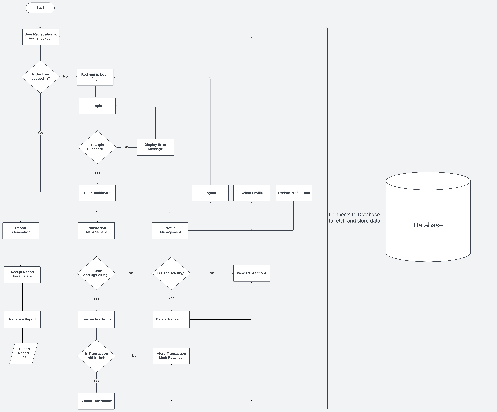
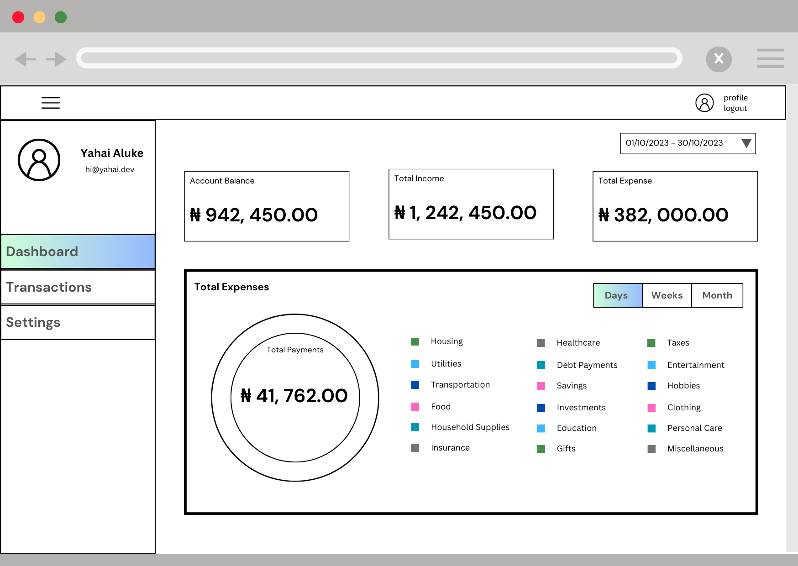
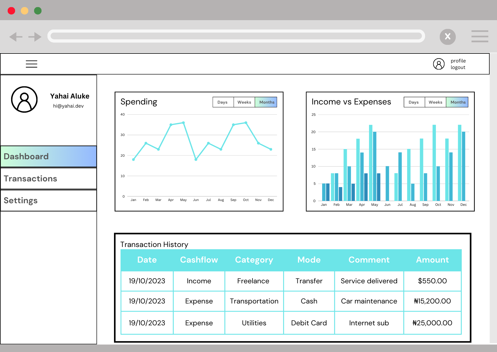
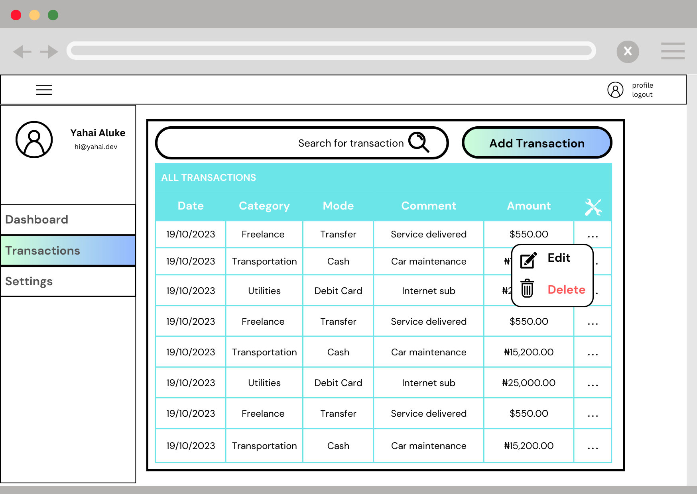
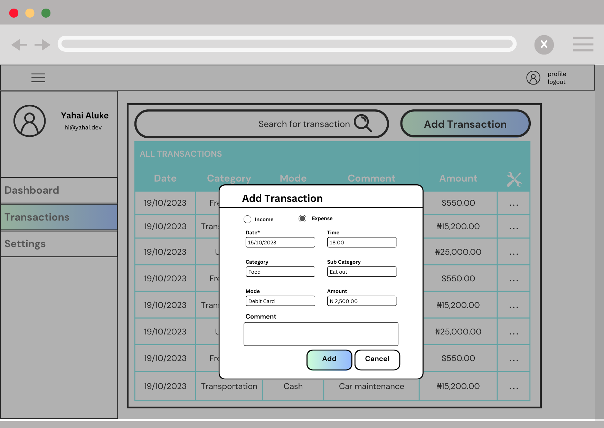
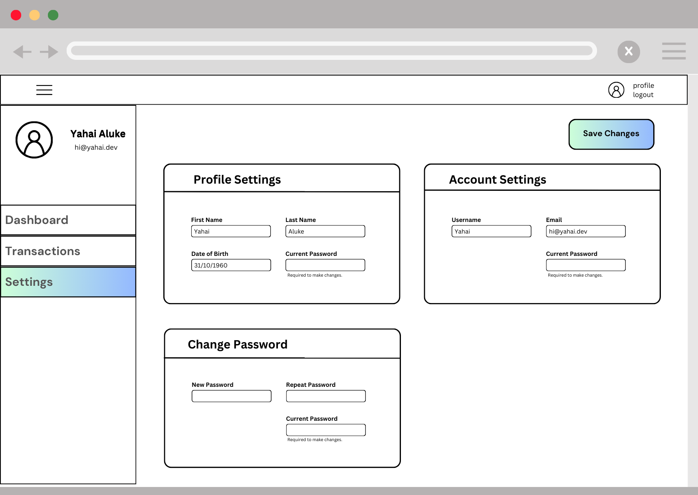

# Bread Crumbs - A Budget Tracker Application

## Project Overview:
The Budget Tracker Application is a web-based financial management tool designed to help users manage their expenses and income effectively. The primary goal of this project is to provide a user-friendly interface for tracking financial transactions, categorizing expenses, and generating useful reports. By offering these features, the application aims to assist users in achieving better financial control and planning.

## Features and Functionality:
- **User Registration and Authentication**: Users can create accounts and log in to access their personal financial data securely.
- **Transaction Management**: Add, edit, and delete transactions with ease, including information like date, description, amount, and category.
- **Expense Categorization**: Organize transactions into different categories, making it easier to track spending habits.
- **Budget Goals**: Allow users to set budget goals and receive notifications when they are approaching their limits.
- **Financial Reports**: Generate reports and visualizations, such as pie charts or bar graphs, to visualize income vs. expenses over time.
- **User-Friendly Interface**: An intuitive and responsive web interface that makes managing finances simple and efficient.

## Technologies Used:
- **Python**: The application is built using the Python programming language.
- **Flask**: A micro web framework for Python is used for creating the web application.
- **SQLAlchemy**: SQLAlchemy is used to interact with the database and manage data models.
- **HTML/CSS**: For creating the user interface and styling.
- **JavaScript**: For adding interactivity to the web pages.
- **MySQL**: A relational database server used for storing user data.

## App Flowchart:

## Bread Crumbs Wireframes:

## Demo:
[Live Demo (Not yet ready)](#)

## Roadmap and Future Enhancements:
In the future, I plan to implement the following enhancements:

- **Expense Insights**: Provide more detailed insights into spending patterns, including monthly and yearly breakdowns.
- **Mobile App**: Develop a mobile application for better accessibility on the go.
- **Data Export**: Enable users to export their financial data in various formats (e.g., CSV, PDF).

## Contact Information:
- **My Name**: Yahaya (Yahai) Aluke
- **Email**: yahayaaaluke@gmail.com
- [GitHub](https://github.com/yahaiii)
- [LinkedIn](https://www.linkedin.com/in/yahayaaluke)

Feel free to reach out if you have any questions or suggestions for improvements!
