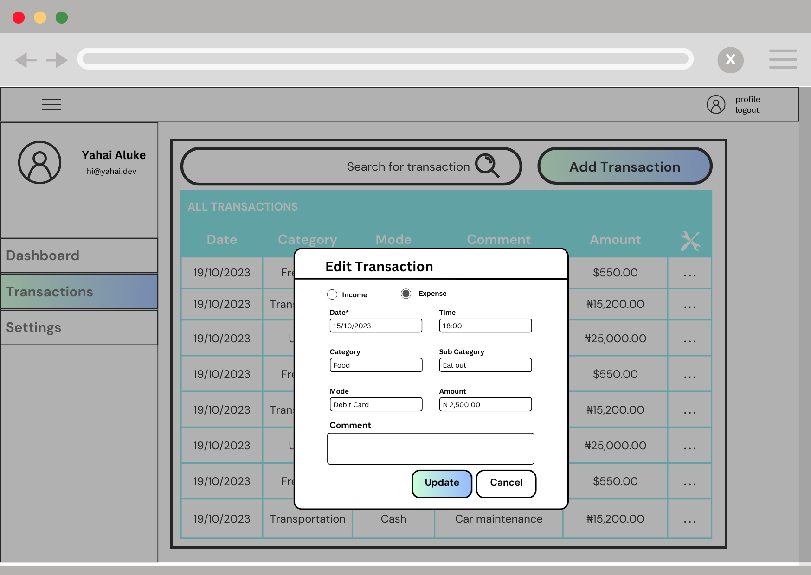

# Breadcrumbs: Trail your money

## Project Overview:
Breadcrumbs automates financial discipline, it means a well-organised and healthy financial life for its users. Its name is a nod to the classic tale of Hansel and Gretel, who leave a trail of breadcrumbs behind them as they walk through a forest, intending to use them in order to retrace their steps. My app will help you trail your way to financial success. Let's not forget that bread is slang for money too, a delightful double entendre. 

This Budget Tracker Application is a web-based financial management tool designed to help users manage their expenses and income effectively by providing a user-friendly interface for tracking financial transactions, categorizing expenses, and generating useful reports. By offering these features, the application aims to assist users in achieving better financial control and planning.

## Features and Functionality:
- **User Registration and Authentication**: Users can create accounts and log in to access their personal financial data securely.
- **Transaction Management**: Add, edit, and delete transactions with ease, including information like date, description, amount, and category.
- **Expense Categorization**: Organize transactions into different categories, making it easier to track spending habits.
- **Budget Goals**: Allow users to set budget goals and receive notifications when they are approaching their limits.
- **Expense Insights**: Provide more detailed insights into spending patterns, including monthly and yearly breakdowns.
- **Financial Reports**: Generate reports and visualizations, such as pie charts or bar graphs, to visualize income vs. expenses over time.
- **Data Export**: Enable users to export their financial data in various formats (e.g., CSV, PDF).
- **User-Friendly Interface**: An intuitive and responsive web interface that makes managing finances simple and efficient.

## Technologies Used:
- **Python**: The application is built using the Python programming language.
- **Flask**: A micro web framework for Python is used for creating the web application.
- **SQLAlchemy**: SQLAlchemy is used to interact with the database and manage data models.
- **HTML/CSS**: For creating the user interface and styling.
- **JavaScript**: For adding interactivity to the web pages.
- **MySQL**: A relational database server used for storing user data.

## `app/` Directory Structure

The `app/` directory within the Breadcrumb application encompasses the core components of the application. It is organized with a strong emphasis on modularity and maintainability. The directory is subdivided to house distinct features and functionalities, each residing within its dedicated subdirectory.

```
alx_capstone_project/
│
│
├── app/
│   ├── forms/
│   │   ├── __init__.py
│   │   ├── login_form.py
│   │   ├── registration_form.py
│   │   ├── settings_form.py
│   │   ├── transaction_form.py
│   ├── routes/
│   │   ├── __init__.py
│   │   ├── auth.py
│   │   ├── categories.py
│   │   ├── data_export.py
│   │   ├── goals.py
│   │   ├── insights.py
│   │   ├── landing.py
│   │   ├── reports.py
│   │   ├── settings.py
│   │   ├── transactions.py
│   ├── static/
│   │   ├── css/
│   │   │   ├── main.css
│   │   ├── js/
│   │   ├── img/
│   │   │   ├── breadcrumbs_logo_black.png
│   │   │   ├── breadcrumbs_logo.png
│   │   │   ├── favicon.ico
│   │   │   ├── profile_image.png
│   ├── templates/
│   │   ├── add_transaction.html
│   │   ├── base.html
│   │   ├── budget_goals.html
│   │   ├── categorize_expense.html
│   │   ├── dashboard.html
│   │   ├── export_data.html
│   │   ├── insights.html
│   │   ├── landing.html
│   │   ├── login.html
│   │   ├── registration.html
│   │   ├── reports.html
│   ├── __init__.py
│   ├── models.py
│
├── migrations/
│   ├── versions/
│   │   ├── v1
│   │   ├── v2
│   ├── alembic.ini
│   ├── env.py
│   ├── README
│   ├── script.py.mako
│
├── tests/
│   ├── integration/
│   ├── unit/
│
├── venv/
│
├── .gitignore
├── CHANGELOG.md
├── config.py
├── README.md
├── requirements.txt
├── run.py
├── WORKFLOW.md

```

### Subdirectories and Files

- **`__init__.py`**: This file assumes the role of initializing the Flask application and configuring it by importing Blueprints. It serves as the main entry point for the application's core functionalities.

- **`routes/`**: Within this directory, individual route definition files are arranged according to the Flask Blueprint pattern.

- **`forms/`**: Organize form classes, these forms will be used for server-side form validation and data processing.

  - **`auth.py`**: This module is responsible for overseeing user registration and authentication. It features route definitions for tasks such as user account creation, login, and logout.

  - **`transactions.py`**: Dedicated to the management of financial transactions, including the operations of adding, editing, and deleting transactions. This section contains routes for performing transaction-related tasks.

  - **`categories.py`**: Specializes in the organization of transactions into distinct categories, offering a simplified approach to tracking spending habits. It includes routes for categorizing transactions.

  - **`goals.py`**: Provides users with the ability to set budget goals and receive notifications as they approach predefined financial limits. This module comprises routes for managing budget goals.

  - **`insights.py`**: Offers comprehensive insights into spending patterns, encompassing detailed breakdowns on a monthly and yearly basis. The module is equipped with routes for insights and analytics.

  - **`reports.py`**: This module focuses on the generation of financial reports and visualizations, such as pie charts and bar graphs, designed to illustrate income versus expenses over a specified period. It features routes for report generation.

  - **`data_export.py`**: Facilitates the export of financial data in various formats, including CSV and PDF. The module encompasses routes for data export functionality.

- **`models.py`**: Within this file, data models are defined to handle the storage and retrieval of data related to user accounts, financial transactions, expense categories, and budget goals.

- **`templates/`**: This directory serves as the repository for HTML templates employed to render diverse views within the application's user interface. The templates are organized based on the various features of the application.

- **`static/`**: This directory is designated for the storage of static files, including CSS stylesheets, JavaScript scripts, and image assets that enhance the user interface of the application.

This structured approach to directory organization within the `app/` directory underscores the principles of separation of concerns, ultimately streamlining the management, enhancement, and collaborative development of the codebase. The implementation of Blueprints ensures that feature-specific routes are logically separated into individual files, thereby facilitating modularity and ensuring code maintainability.

## App Flowchart:


## Database Schema:


## Breadcrumbs Wireframes:





## Demo:
[Live Demo (Not yet ready)](#)

## Roadmap and Future Enhancements:
In the future, I plan to implement the following enhancements:

- **Mobile App**: Develop a mobile application for better accessibility on the go.
- **OCR Input**: Record expense by snapping a picture of the receipt.
- **Integration with Bank Accounts**: Improve transaction logging by syncing with bank accounts.

## Contact Information:
- **Developer**: Yahaya (Yahai) Aluke
- **Email**: yahayaaaluke@gmail.com
- [LinkedIn](https://www.linkedin.com/in/yahayaaluke)
- [Twitter](https://www.twitter.com/yahaiii)

Feel free to reach out if you have any questions or suggestions for improvements!
